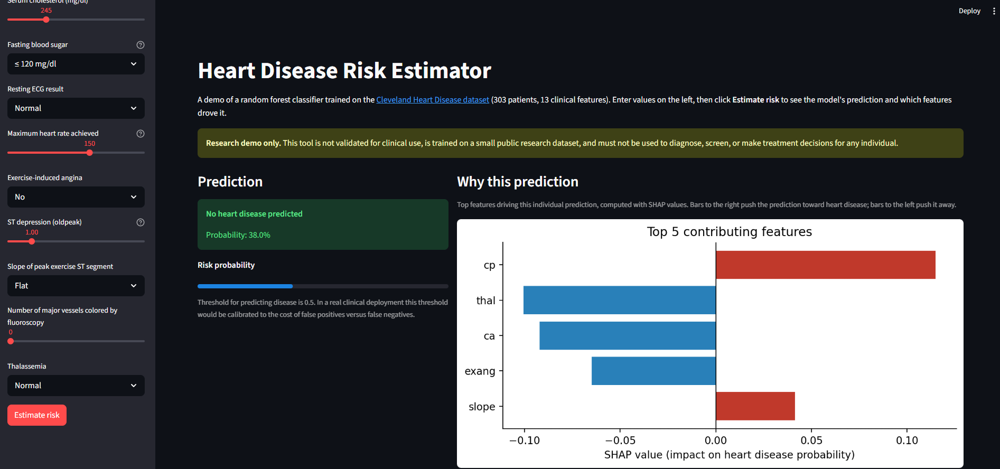
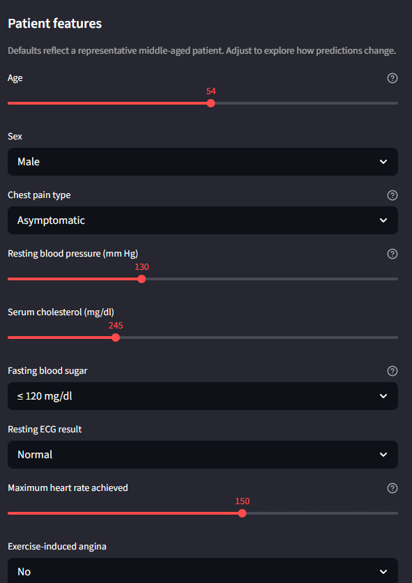

# heart-disease-risk-app

Interactive web app for heart disease risk estimation. Wraps a random forest classifier trained on the Cleveland Heart Disease dataset in a [Streamlit](https://streamlit.io/) interface, with [SHAP](https://shap.readthedocs.io/) explanations for each prediction.

**Live demo:** _add Streamlit Community Cloud URL here after deployment_

## Why this matters

A classifier sitting in a notebook is hard to evaluate without engineering experience. A clinician, practice administrator, or non-technical reviewer cannot read a confusion matrix and tell whether the model is doing something useful. This project takes the trained model from [heart-disease-ml-prediction](https://github.com/Nelsike/heart-disease-ml-prediction) and wraps it in an interface anyone can use: enter values, click a button, see a risk estimate and the features that drove it.

This repo is a research and educational demo. It is not a clinical tool and the predictions must not be used for medical decision-making.

## What the app does

The user enters the 13 Cleveland features through a sidebar form with friendly labels and sensible defaults. On clicking **Estimate risk**, the app returns:

- **A binary prediction** of heart disease presence at the default 0.5 threshold.
- **A risk probability** displayed as a percentage and a progress bar.
- **A SHAP explanation** showing the top five features that pushed the prediction toward or away from heart disease, with directional bars.
- **A clear disclaimer** that this is a research demo, not a clinical tool.

## Screenshots

### Prediction with SHAP explanation


### Input form


## Model

The deployed model is a `RandomForestClassifier` from scikit-learn 1.8.0 with default hyperparameters and `random_state=42`, trained on an 80/20 train/test split of the Cleveland Heart Disease dataset (303 records, 13 features). Reported test-set performance:

| Metric | Value |
| --- | --- |
| Accuracy | 0.869 |
| ROC AUC | 0.93 |

For the full modeling workflow, exploratory analysis, and comparison with logistic regression, see [heart-disease-ml-prediction](https://github.com/Nelsike/heart-disease-ml-prediction).

## Tech stack

- **Python 3.11**
- **Streamlit** for the interface
- **scikit-learn** for the model
- **SHAP** for per-prediction feature attribution
- **joblib** for model serialization
- **matplotlib** for the SHAP bar plot

## Repository structure

```text
heart-disease-risk-app/
├── app.py                          # Streamlit application
├── train.py                        # Reproduces the model artifact
├── heart_rf_model.joblib           # Serialized random forest
├── feature_names.joblib            # Feature order expected by the model
├── Heart_disease_cleveland_new.csv # Cleveland dataset
├── requirements.txt
├── LICENSE
└── README.md
```

## Running locally

```bash
# Clone the repo
git clone https://github.com/Nelsike/heart-disease-risk-app.git
cd heart-disease-risk-app

# Create and activate a virtual environment (Python 3.11)
python -m venv .venv
source .venv/bin/activate          # macOS/Linux
.\.venv\Scripts\Activate.ps1       # Windows PowerShell

# Install dependencies
pip install -r requirements.txt

# (Optional) retrain the model from the dataset
python train.py

# Launch the app
streamlit run app.py
```

The app opens at `http://localhost:8501`.

## Deployment

The live demo is hosted on [Streamlit Community Cloud](https://streamlit.io/cloud), which deploys directly from this GitHub repository. Any push to `main` redeploys the app automatically.

## Limitations

The Cleveland Heart Disease dataset is small (303 records) and well-studied. Results characterize model behavior on this dataset and should not be extrapolated to other populations or clinical settings. Calibration of the predicted probabilities has not been verified.

The 0.5 classification threshold is used by default. In any clinical decision-support context, threshold selection should be calibrated to the relative cost of false positives and false negatives.

SHAP attributions explain individual predictions but do not establish causation. They show which features the model is using, not which features actually cause heart disease.

## Related work

- [heart-disease-ml-prediction](https://github.com/Nelsike/heart-disease-ml-prediction) — modeling notebook and EDA that produced the underlying classifier.
- [fed-dp-cardio](https://github.com/Nelsike/fed-dp-cardio) — research benchmark comparing centralized, federated, and differentially private federated learning on the same problem domain.

## Author

**Joshua Sanchez**
Doctor of Computer Science (in progress), Colorado Technical University
[GitHub](https://github.com/Nelsike) · [LinkedIn](https://www.linkedin.com/in/sanchezgutierrez/)

## License

MIT. See [LICENSE](LICENSE) for details.
